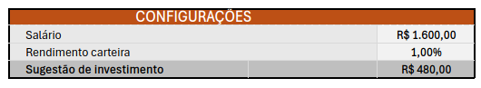
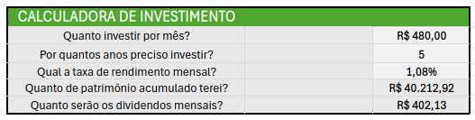
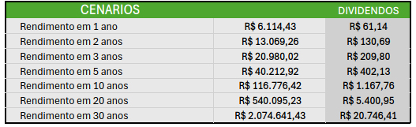
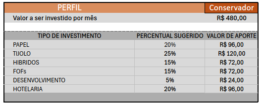
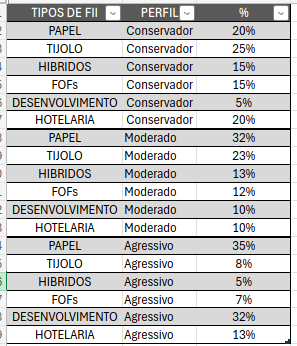
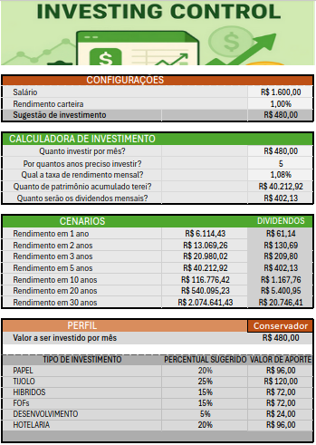

# Ferramenta de Controle de Investimento com Excel

## Perguntas principais as quais a ferramenta se propõe a responder
1. Quanto investir por mês.
2. Por quantos anos investir.
3. Com qual taxa de rendimento mensal.
4. Qual  será o patrimônio acumulado.
5. Quais serão os dividendos mensais.

## Workflow
Antes de tudo, para dar um aspecto de aplicação foi adicionado um banner gerado a partir da ferramenta [sora](https://sora.chatgpt.com) e ocultados as linhas de grades, títulos e barra de formulas para deixar a visão mais limpa.

A imagem original gerada no sora tem o formato 3:2 sendo necessário utilizar a ferramenta de cortar a image para um formato mais retangular.

### Configurações

Após o banner foi elaborado uma área de configurações onde o usuário pode inserir seu salário e o valor mensal de rendimento de sua carteira, e também um campo calculado onde é sugerido um valor de investimento baseado no valor do salário e que responde a nossa primeira pergunta de negócio.

### Cálculos de investimentos

Tendo pronta a área de configurações, há também a parte de calculo dos investimentos. Na área de calculo de investimento o usuário pode inserir um valor no qual ele deseja investir, por quantos anos ele deseja manter seu investimento e qual será a taxa de rendimento mensal. A partir destas informações serão feitos os cálculos de `qual será o patrimônio acumulado` e `quais serão os dividendos mensais` visando responder nossas perguntas de negócio 3, 4 e 5.

### Cenários
Também foi criado uma área onde estão inseridos os cenários de investimentos para os períodos de 1, 2, 3, 5, 10, 20 e 30 anos, mostrando o calculo de patrimônio e valor de dividendos que responde de forma ampla nossa pergunta de negócio 2.

### Perfil de investidor
Por fim, também há uma área de perfil do investidor com um seletor onde o usuário pode selecionar um perfil entre `Conservador`, `Moderado` e `Agressivo` que se utiliza do valor inserido na area de cálculos de investimento para calcular o valor de aporte a partir de percentuais sugeridos.

Os percentuais são configurados a partir da planilha nomeada como `pct_investimento_por_perfil` que se utiliza de uma `chave composta` oculta e a formula `PROCV` para inserção dinâmica na `Planilha1` de acordo com o perfil e o tipo de `FII`, ela foi formatada como tabela, e os valores das colunas `PERFIL` e `%` (porcentagem a ser investida por um perfil a um FII) foram limitados a uma lista de valores que estão presentes nas sheets `normalize_tipos_fii` e `normalize_perfil`

Além disso adicionei proteção a planilha deixando somente os campos que são realmente necessários para serem passiveis de alteração. Por fim a planilha um ficou assim:

